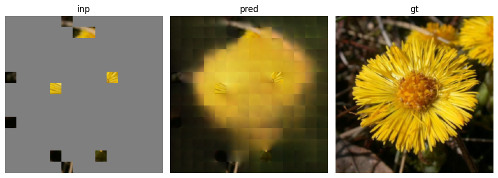

# MAE PyTorch

Simple implementation of MAE, mask out some patches in input image, send patches not masked into a transformer encoder, cat encoder output with mask tokens into transformer decoder to reconstruct original image.

# Result
model trained with mask_ratio=0.75, infer in different mask ratio.

* mask_ratio = 0.5

* mask_ratio = 0.75

* mask_ratio = 0.90

* mask_ratio = 0.95

# TODO
* train a vit on this dataset, and pretrain MAE on it, varify whether MAE pretrained can improve acc